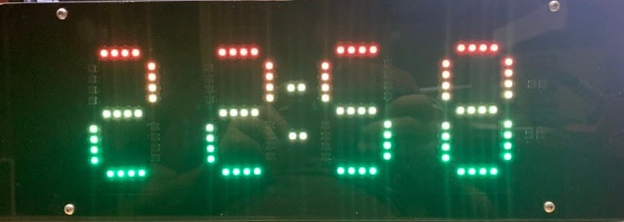
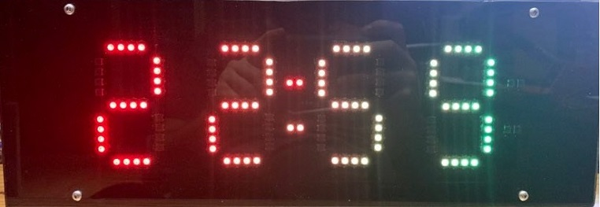
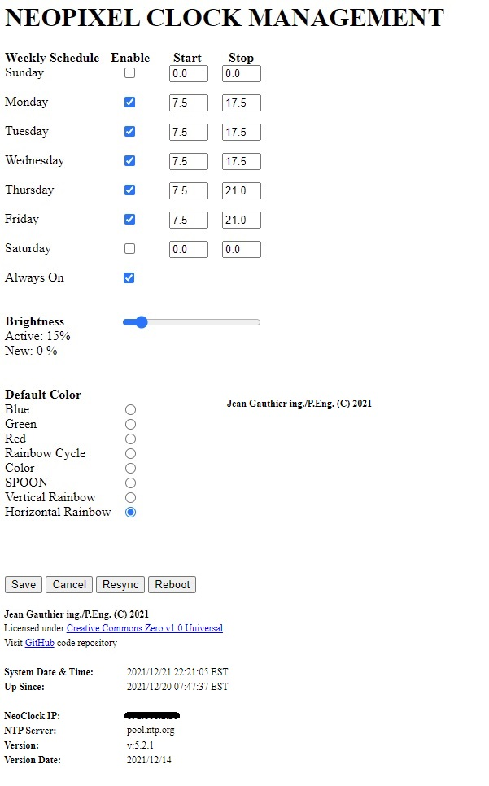

# NEO Pixel Clock

#### Status: Completed - In Service ####

#### Devices: ESP8266, WS2812, Logic Level Converter ####

### Description: ###
Based on the neo pixels chips WS2812 5050, I purchased 8m of LED strips with 144LEDs/meter.






#### Features: ####

- Displays actual time (hh:mm) and ":" is flashing every second
- Internal RTC to keep time and updates from NTP once every hour or if time is lost (reboot)
- Get time from NTP server, has a function to calculate DST
- Webserver can be found at local IP (reported on serial bus) or by typing http://do2_neoclock/
- Physical button on GPIO0 for programming, but can also change color (must not be pressed on power up)

#### Credits
- Neo7segment.h:   [UnexpectedMaker](https://github.com/UnexpectedMaker/Neo7Segment)
The initial library neo7segment.h has been modified by me to adjust the number of pixels per segment and has now been merged to master. The original library gave the possibility to adjust the number of digits, but not the quantity of pixels per segment. Since I wanted a very large clock display (8 pixels per segment) and 4 pixels digits for the outdoor temperature/humidity and for the pool water temperature, I had to modify the library to suite my needs.

- NTPClient.h:     [Fabrice Weinberg](https://github.com/arduino-libraries/NTPClient)
The initial library NTPClient.h has been modified to add the following function for which a [Pull Request](https://github.com/arduino-libraries/NTPClient/pull/125) has been made by someone else

NTPClient.cpp
```cpp
void NTPClient::setPoolServerIP(IPAddress poolServerIP) {
    this->_poolServerIP   = poolServerIP;
    this->_poolServerName = NULL;
}
```

NTPClient.h
```
    /**
     * Set time server name
     *
     * @param poolServerIP
     */
    void setPoolServerIP(IPAddress poolServerIP);
```
